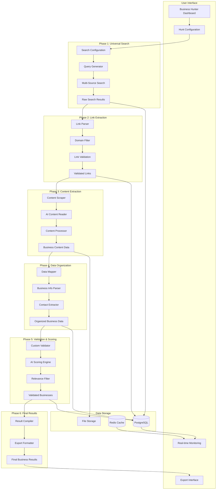

# Business Hunter Data Flow Architecture

## Overview

The Business Hunter processes data through 6 distinct phases, with each phase building upon the previous one. The system is designed to handle ANY type of business discovery workflow with configurable parameters at each stage.

## Complete Data Flow Diagram



## Phase-by-Phase Data Transformation

### Phase 1: Universal Search
**Input**: User configuration parameters
**Process**: Generate search queries for ANY business type
**Output**: Raw search results with URLs and basic metadata

```javascript
// Input Configuration
{
    industry: "Technology",
    businessTypes: ["SaaS", "Software"],
    locations: ["San Francisco, CA"],
    keywords: ["cloud", "enterprise"]
}

// Generated Queries
[
    "SaaS companies San Francisco CA",
    "cloud enterprise software San Francisco",
    "Technology businesses San Francisco CA"
]

// Raw Search Results
[
    {
        url: "https://company1.com",
        title: "Company1 - Enterprise SaaS Platform",
        snippet: "Leading cloud-based enterprise software...",
        source: "google",
        timestamp: "2024-03-15T10:30:00Z"
    }
]
```

### Phase 2: Link Extraction
**Input**: Raw search results with URLs
**Process**: Extract, validate, and deduplicate business website links
**Output**: Clean list of unique business website URLs

```javascript
// Input: Raw Results
[
    {url: "https://company1.com/about"},
    {url: "https://company1.com/products"},
    {url: "https://linkedin.com/company/company1"},
    {url: "https://company2.com"}
]

// Process: Domain extraction and deduplication
domains_found = ["company1.com", "company2.com"]

// Output: Validated Links
[
    {
        domain: "company1.com",
        primary_url: "https://company1.com",
        discovered_urls: [
            "https://company1.com/about",
            "https://company1.com/products"
        ],
        source_info: {
            discovery_source: "google",
            relevance_score: 0.85
        }
    }
]
```

### Phase 3: Content Extraction
**Input**: Validated business website URLs
**Process**: Scrape website content and extract business information
**Output**: Rich business content data

```javascript
// Input: Business URLs
[
    {domain: "company1.com", primary_url: "https://company1.com"}
]

// Process: Content scraping + AI extraction
content_extracted = {
    raw_html: "<html>...</html>",
    text_content: "Company1 provides enterprise SaaS solutions...",
    structured_data: {
        company_name: "Company1 Inc",
        description: "Enterprise SaaS platform for...",
        industry: "Technology",
        services: ["Cloud Platform", "Enterprise Software"]
    }
}

// Output: Business Content Data
[
    {
        domain: "company1.com",
        company_info: {
            name: "Company1 Inc",
            description: "Enterprise SaaS platform...",
            industry: "Technology",
            business_type: "SaaS"
        },
        content_analysis: {
            key_terms: ["enterprise", "SaaS", "cloud", "platform"],
            sentiment: "professional",
            content_quality: 0.92
        }
    }
]
```

### Phase 4: Data Organization
**Input**: Raw business content data
**Process**: Parse and organize into structured business records
**Output**: Standardized business data with contact information

```javascript
// Input: Raw Content
{
    domain: "company1.com",
    raw_content: "Company1 Inc provides...",
    extracted_text: "Contact us at info@company1.com or (555) 123-4567"
}

// Process: Data parsing and organization
structured_business = {
    company_name: "Company1 Inc",
    industry: "Technology",
    business_type: "SaaS",
    contact_info: {
        email: "info@company1.com",
        phone: "(555) 123-4567",
        website: "https://company1.com"
    },
    location: {
        address: "123 Main St, San Francisco, CA",
        city: "San Francisco",
        state: "CA",
        country: "USA"
    }
}

// Output: Organized Business Data
[
    {
        id: "business_001",
        domain: "company1.com",
        business_info: structured_business,
        data_quality_score: 0.89,
        completeness_score: 0.75
    }
]
```

### Phase 5: Validation & Scoring
**Input**: Organized business data
**Process**: Apply custom validation rules and relevance scoring
**Output**: Validated and scored business matches

```javascript
// Input: Organized Data
{
    business_info: {
        name: "Company1 Inc",
        industry: "Technology",
        business_type: "SaaS"
    }
}

// Process: Custom validation based on hunt configuration
validation_results = {
    industry_match: true,  // Matches "Technology"
    business_type_match: true,  // Matches "SaaS"
    location_match: true,  // Located in San Francisco
    keyword_relevance: 0.85,  // High relevance to search keywords
    data_quality: 0.89  // High quality business data
}

// Calculate relevance score
relevance_score = (
    industry_match * 0.3 +
    business_type_match * 0.3 +
    location_match * 0.2 +
    keyword_relevance * 0.2
) = 0.87

// Output: Validated Businesses
[
    {
        business_id: "business_001",
        business_info: {...},
        validation_results: validation_results,
        relevance_score: 0.87,
        match_quality: "High",
        validation_status: "Approved"
    }
]
```

### Phase 6: Final Results
**Input**: Validated and scored businesses
**Process**: Compile final results and format for export
**Output**: Ready-to-use business leads with complete information

```javascript
// Input: Validated Businesses
[
    {
        business_id: "business_001",
        relevance_score: 0.87,
        business_info: {...}
    }
]

// Process: Result compilation and formatting
final_results = {
    hunt_info: {
        hunt_name: "Bay Area SaaS Companies",
        total_found: 156,
        high_quality_matches: 89,
        completion_date: "2024-03-15T14:30:00Z"
    },
    businesses: [
        {
            company_name: "Company1 Inc",
            industry: "Technology",
            business_type: "SaaS",
            website: "https://company1.com",
            email: "info@company1.com",
            phone: "(555) 123-4567",
            location: "San Francisco, CA",
            relevance_score: 87,
            match_quality: "High",
            discovered_date: "2024-03-15T10:30:00Z"
        }
    ]
}

// Output: Export-Ready Results
- CSV file with business data
- CRM import format
- API-accessible data
- Detailed analytics report
```

## Data Storage Strategy

### PostgreSQL Tables
```sql
-- Hunts/Workflows
CREATE TABLE hunts (
    id UUID PRIMARY KEY,
    name VARCHAR(255),
    status VARCHAR(50),
    configuration JSONB,
    created_at TIMESTAMP,
    completed_at TIMESTAMP
);

-- Search Results (Phase 1)
CREATE TABLE search_results (
    id UUID PRIMARY KEY,
    hunt_id UUID REFERENCES hunts(id),
    url TEXT,
    title TEXT,
    snippet TEXT,
    source VARCHAR(100),
    created_at TIMESTAMP
);

-- Business Links (Phase 2)
CREATE TABLE business_links (
    id UUID PRIMARY KEY,
    hunt_id UUID REFERENCES hunts(id),
    domain VARCHAR(255),
    primary_url TEXT,
    discovered_urls JSONB,
    source_info JSONB
);

-- Business Content (Phase 3)
CREATE TABLE business_content (
    id UUID PRIMARY KEY,
    hunt_id UUID REFERENCES hunts(id),
    domain VARCHAR(255),
    raw_content TEXT,
    structured_content JSONB,
    content_analysis JSONB
);

-- Organized Businesses (Phase 4)
CREATE TABLE businesses (
    id UUID PRIMARY KEY,
    hunt_id UUID REFERENCES hunts(id),
    domain VARCHAR(255),
    business_info JSONB,
    contact_info JSONB,
    location_info JSONB,
    data_quality_score FLOAT
);

-- Validated Results (Phase 5)
CREATE TABLE validated_businesses (
    id UUID PRIMARY KEY,
    business_id UUID REFERENCES businesses(id),
    validation_results JSONB,
    relevance_score FLOAT,
    match_quality VARCHAR(50),
    validation_status VARCHAR(50)
);

-- Final Results (Phase 6)
CREATE TABLE final_results (
    id UUID PRIMARY KEY,
    hunt_id UUID REFERENCES hunts(id),
    business_data JSONB,
    export_formats JSONB,
    created_at TIMESTAMP
);
```

### Redis Caching Strategy
```javascript
// Real-time progress tracking
redis.set(`hunt:${hunt_id}:progress`, JSON.stringify({
    phase: 3,
    completion_percentage: 65,
    current_status: "Extracting content from websites",
    businesses_found: 156,
    last_updated: Date.now()
}));

// Temporary data storage
redis.setex(`hunt:${hunt_id}:temp_results`, 3600, JSON.stringify(temp_data));

// Search result caching
redis.setex(`search:${query_hash}`, 1800, JSON.stringify(search_results));
```

## Data Quality Metrics

### Phase Completion Tracking
```javascript
const phaseMetrics = {
    phase1: {
        queries_executed: 45,
        results_found: 1247,
        unique_domains: 892,
        success_rate: 0.95
    },
    phase2: {
        links_processed: 892,
        valid_links: 756,
        duplicate_removal: 136,
        validation_rate: 0.85
    },
    phase3: {
        websites_scraped: 756,
        content_extracted: 689,
        ai_processing_success: 0.91,
        data_quality_avg: 0.87
    },
    phase4: {
        businesses_processed: 689,
        complete_records: 534,
        contact_info_found: 445,
        completeness_rate: 0.77
    },
    phase5: {
        businesses_validated: 534,
        high_quality_matches: 312,
        medium_quality_matches: 156,
        validation_rate: 0.88
    },
    phase6: {
        final_businesses: 468,
        export_formats_created: 3,
        data_completeness: 0.91,
        overall_success_rate: 0.85
    }
};
```

This data flow architecture ensures that ANY type of business discovery workflow can be processed efficiently with full transparency and quality control at each stage.