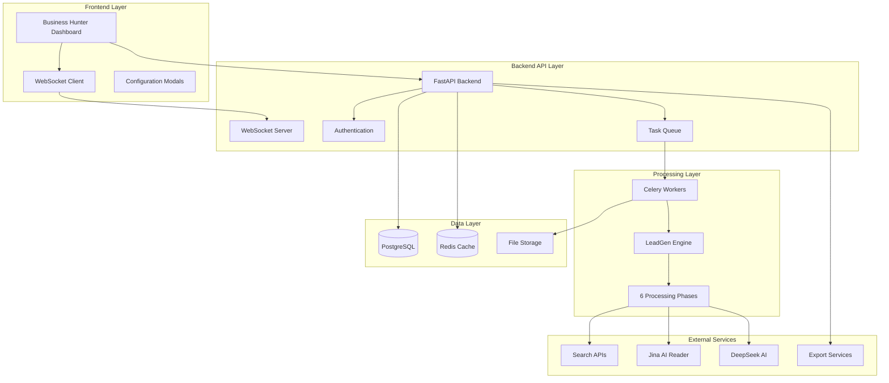
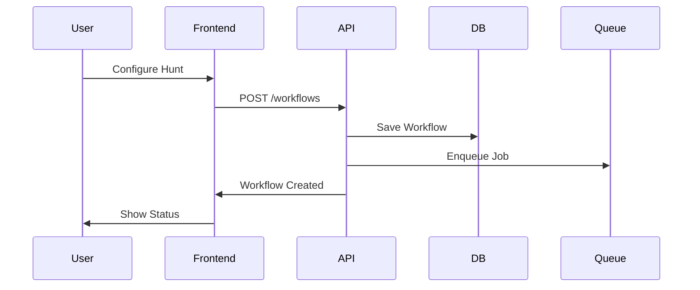
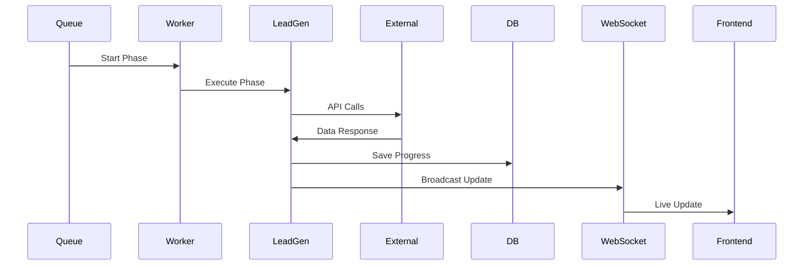

# Business Hunter System Architecture

## High-Level Architecture

The Business Hunter system implements a distributed architecture with clear separation between frontend UI, backend API services, and the LeadGen processing engine.

## Component Overview

### Frontend Layer

**Business Hunter Dashboard**
- React-based user interface
- Neobrutalist design system integration
- Real-time workflow monitoring
- Configuration and management tools

**WebSocket Client**
- Real-time progress updates
- Live status monitoring
- Error notifications
- Performance metrics streaming

**Configuration Modals**
- Hunt creation and setup
- Parameter configuration
- Export settings
- Workflow management

### Backend API Layer

**FastAPI Backend**
- RESTful API endpoints
- JWT authentication
- Request validation
- Error handling
- Rate limiting

**WebSocket Server**
- Real-time communication
- Progress broadcasting
- Status updates
- Live logging

**Task Queue**
- Celery-based job processing
- Background task execution
- Retry mechanisms
- Priority scheduling

### Processing Layer

**LeadGen Engine**
- Adapted Python scripts
- Phase orchestration
- Error recovery
- Progress tracking

**6 Processing Phases**
1. **Search Phase**: Configurable multi-source business discovery for ANY industry
2. **Extract Phase**: Link collection and normalization from discovered businesses
3. **Content Phase**: Website content extraction and business data gathering
4. **Save Phase**: Data organization and storage with custom field mapping
5. **Validate Phase**: Configurable business validation based on user criteria
6. **Report Phase**: Custom result compilation with user-defined export formats

### Data Layer

**PostgreSQL Database**
- Workflow definitions
- User accounts
- Configuration settings
- Audit logs

**Redis Cache**
- Session management
- Real-time status
- Temporary data
- Job queues

**File Storage**
- Raw scraped content
- Processed results
- Export files
- Log files

### External Services

**Search APIs**
- Google Search API
- Bing Search API
- Specialized business directories
- Social media APIs

**AI Services**
- Jina AI Reader for content extraction
- DeepSeek AI for validation
- OpenAI for content analysis
- Custom ML models

## Data Flow Architecture

### Workflow Creation Flow

### Phase Execution Flow

## Scalability Considerations

### Horizontal Scaling
- Multiple Celery worker instances
- Load-balanced API servers
- Distributed Redis cluster
- CDN for static assets

### Performance Optimization
- Database indexing strategy
- Caching layers
- Background job prioritization
- Resource pooling

### Monitoring and Observability
- Application metrics
- Performance monitoring
- Error tracking
- Resource utilization

## Security Architecture

### Authentication & Authorization
- JWT-based authentication
- Role-based access control
- API key management
- Session security

### Data Protection
- Encryption at rest
- Secure API communications
- PII data handling
- Audit logging

### External API Security
- API key rotation
- Rate limiting
- Request validation
- Error sanitization

## Technology Stack

### Frontend
- **Framework**: Next.js 14 with React 18
- **Styling**: Tailwind CSS + Neobrutalist design system
- **State Management**: React hooks + Context API
- **Real-time**: WebSocket client
- **Build Tool**: Vite/Webpack

### Backend
- **Framework**: FastAPI (Python)
- **Task Queue**: Celery with Redis broker
- **Database**: PostgreSQL with SQLAlchemy ORM
- **Cache**: Redis
- **WebSocket**: FastAPI WebSocket support
- **Authentication**: JWT with bcrypt

### Processing
- **LeadGen Engine**: Python scripts with async/await
- **AI Services**: Jina AI, DeepSeek AI, OpenAI
- **Search APIs**: Multiple providers with fallback
- **Data Processing**: Pandas, BeautifulSoup, httpx

### Infrastructure
- **Deployment**: Docker containers
- **Orchestration**: Docker Compose / Kubernetes
- **Monitoring**: Prometheus + Grafana
- **Logging**: Structured logging with ELK stack
- **File Storage**: Local filesystem / S3-compatible storage