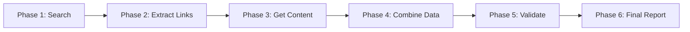

# Hunter LeadGen API - Onboarding Guide

## Welcome to Hunter LeadGen! 🎯

Hunter LeadGen is a powerful lead generation system that helps you find, validate, and enrich business leads based on your specific criteria. This guide will help you understand how to integrate and use the Hunter LeadGen API effectively.

## Table of Contents
1. [Quick Start](#quick-start)
2. [Understanding the System](#understanding-the-system)
3. [Frontend Integration](#frontend-integration)
4. [Search Configuration](#search-configuration)
5. [Validation Criteria](#validation-criteria)
6. [Monitoring Progress](#monitoring-progress)
7. [Working with Results](#working-with-results)
8. [Subscription Tiers](#subscription-tiers)
9. [Best Practices](#best-practices)
10. [FAQs](#faqs)

## Quick Start

### 1. Basic Search Flow
```javascript
// Step 1: Create search configuration
const searchConfig = {
  searchName: "Find SaaS Startups",
  searchObjective: "Partner with B2B SaaS companies",
  selectedSources: ["web"],
  industry: "Technology",
  location: "United States",
  includeEmails: true,
  includePhones: true,
  validationCriteria: {
    mustHaveWebsite: true,
    mustHaveContactInfo: true,
    mustHaveSpecificKeywords: ["SaaS", "B2B", "API"],
    mustBeInIndustry: true,
    customValidationRules: "Must serve enterprise clients"
  }
};

// Step 2: Start search via Convex
const result = await createLeadSearch({
  userId: user.id,
  searchConfig
});

// Step 3: Poll for results
const status = await getSearchStatus({ 
  searchId: result.searchId 
});
```

### 2. Complete Integration Example
See the Hunter onboarding page at `/frontend/src/app/onboarding/hunter/page.tsx` for a full implementation.

## Understanding the System

### How Hunter LeadGen Works

1. **Search Definition**: You define what kind of leads you're looking for
2. **Multi-Phase Processing**: The system processes your request through 6 phases
3. **Real-time Updates**: Get progress updates as the search runs
4. **Validated Results**: Only leads matching your criteria are returned
5. **Contact Enrichment**: Emails, phones, and social profiles are extracted

### The 6 Processing Phases



1. **Search Query Generation**: Creates smart search queries based on your criteria
2. **Link Extraction**: Finds relevant URLs from search results
3. **Content Extraction**: Gets full content from websites using Jina Reader
4. **Data Combination**: Merges all extracted information
5. **Validation**: Checks each lead against your criteria
6. **Report Generation**: Extracts contacts and creates final lead list

## Frontend Integration

### Setting Up the Search

```typescript
// Import required functions
import { useAction } from "convex/react";
import { api } from "@convex/_generated/api";

// In your component
const createLeadSearch = useAction(api.hunterActions.createLeadSearch);
const getSearchStatus = useAction(api.hunterActions.getSearchStatus);
```

### Complete Search Component Example

```typescript
function HunterSearch() {
  const [searchConfig, setSearchConfig] = useState({
    searchName: "",
    searchObjective: "",
    selectedSources: ["web"],
    industry: "",
    location: "",
    includeEmails: true,
    includePhones: false,
    validationCriteria: {
      mustHaveWebsite: true,
      mustHaveContactInfo: true,
      mustHaveSpecificKeywords: [],
      mustBeInIndustry: true,
      customValidationRules: ""
    }
  });

  const startSearch = async () => {
    try {
      const result = await createLeadSearch({
        userId: user.id,
        searchConfig
      });
      
      // Start polling for progress
      pollSearchProgress(result.searchId);
    } catch (error) {
      console.error("Search failed:", error);
    }
  };

  const pollSearchProgress = async (searchId: string) => {
    const interval = setInterval(async () => {
      const status = await getSearchStatus({ searchId });
      
      if (status.status === "completed") {
        clearInterval(interval);
        // Handle completed search
      } else if (status.status === "failed") {
        clearInterval(interval);
        // Handle error
      }
    }, 10000); // Poll every 10 seconds
  };
}
```

## Search Configuration

### Required Fields

```typescript
interface SearchConfig {
  searchName: string;              // Display name for your search
  searchObjective: string;         // What you're trying to achieve
  selectedSources: string[];       // ["web", "database", "directory"]
  industry: string;                // Target industry
  location: string;                // Geographic location
  includeEmails: boolean;          // Extract email addresses
  includePhones: boolean;          // Extract phone numbers
  includeLinkedIn: boolean;        // Extract LinkedIn profiles
  validationCriteria: ValidationCriteria;  // Your validation rules
}
```

### Example Configurations

#### Finding Tech Startups
```javascript
{
  searchName: "Bay Area AI Startups",
  searchObjective: "Find AI startups for partnership opportunities",
  selectedSources: ["web"],
  industry: "Technology",
  location: "San Francisco Bay Area",
  companySize: "1-50",
  jobTitles: ["CEO", "CTO", "Founder"],
  keywords: "artificial intelligence, machine learning",
  includeEmails: true,
  includePhones: true,
  validationCriteria: {
    mustHaveWebsite: true,
    mustHaveContactInfo: true,
    mustHaveSpecificKeywords: ["AI", "ML", "artificial intelligence"],
    mustBeInIndustry: true,
    customValidationRules: "Must have raised funding or have paying customers"
  }
}
```

#### Finding Local Businesses
```javascript
{
  searchName: "Local Restaurants NYC",
  searchObjective: "Find restaurants for delivery app partnerships",
  selectedSources: ["web", "directory"],
  industry: "Food & Beverage",
  location: "New York City",
  includeEmails: true,
  includePhones: true,
  validationCriteria: {
    mustHaveWebsite: false,  // Many restaurants don't have websites
    mustHaveContactInfo: true,
    mustHaveSpecificKeywords: ["restaurant", "dining", "food"],
    mustBeInIndustry: true,
    customValidationRules: "Must be currently operating"
  }
}
```

## Validation Criteria

### Understanding Validation Options

```typescript
interface ValidationCriteria {
  mustHaveWebsite: boolean;
  // Requires a working website URL

  mustHaveContactInfo: boolean;
  // Requires at least one contact method (email/phone)

  mustHaveSpecificKeywords: string[];
  // Website must contain these keywords
  // Example: ["API", "integration", "enterprise"]

  mustBeInIndustry: boolean;
  // Must match the specified industry

  customValidationRules: string;
  // Natural language rules for AI validation
  // Example: "Must offer a free trial or demo"
}
```

### Validation Examples

#### Strict B2B Validation
```javascript
{
  mustHaveWebsite: true,
  mustHaveContactInfo: true,
  mustHaveSpecificKeywords: ["enterprise", "B2B", "business"],
  mustBeInIndustry: true,
  customValidationRules: "Must explicitly mention serving business clients and have case studies or testimonials"
}
```

#### Flexible Local Business Validation
```javascript
{
  mustHaveWebsite: false,
  mustHaveContactInfo: true,
  mustHaveSpecificKeywords: [],
  mustBeInIndustry: false,
  customValidationRules: "Must have physical address and business hours"
}
```

## Monitoring Progress

### Progress Updates Structure

```typescript
interface SearchStatus {
  searchId: string;
  status: "pending" | "processing" | "completed" | "failed";
  progress: number;        // 0-100
  currentStage?: string;   // Human-readable stage description
  totalLeads?: number;     // Available when completed
  error?: string;          // Error message if failed
}
```

### Progress Stages

1. **0-10%**: Initializing search
2. **10-20%**: Generating search queries (Phase 1)
3. **20-30%**: Extracting links (Phase 2)
4. **30-50%**: Extracting content from websites (Phase 3)
5. **50-60%**: Combining data (Phase 4)
6. **60-80%**: Validating against criteria (Phase 5)
7. **80-100%**: Creating final report (Phase 6)

### Visual Progress Display

```typescript
function SearchProgress({ searchId }) {
  const [status, setStatus] = useState(null);

  return (
    <div>
      <h3>{status?.currentStage || "Processing..."}</h3>
      <ProgressBar value={status?.progress || 0} max={100} />
      {status?.status === "completed" && (
        <div>
          Found {status.totalLeads} qualified leads!
        </div>
      )}
    </div>
  );
}
```

## Working with Results

### Accessing Search Results

```typescript
// Get search results with pagination
const results = await getSearchResults({
  searchId: "search_123",
  limit: 50,
  offset: 0,
  filters: {
    emailVerified: true,
    minConfidence: 0.8
  }
});
```

### Lead Data Structure

```typescript
interface Lead {
  leadId: string;
  name?: string;
  email?: string;
  phone?: string;
  linkedInUrl?: string;
  websiteUrl?: string;
  companyName?: string;
  companySize?: string;
  industry?: string;
  location?: string;
  jobTitle?: string;
  emailVerified: boolean;
  phoneVerified: boolean;
  confidence: number;      // 0-1 score
  dataSource: string;      // "web", "database", etc.
}
```

### Exporting Results (Premium Feature)

```typescript
const exportJob = await exportSearchResults({
  userId: user.id,
  searchId: "search_123",
  format: "csv",  // or "json", "xlsx"
  fields: ["companyName", "email", "phone", "websiteUrl"],
  filters: {
    emailVerified: true
  }
});
```

## Subscription Tiers

### Free Tier
- **Searches per day**: 5
- **Leads per search**: 50
- **Monthly lead limit**: 250
- **Data retention**: 7 days
- **Sources**: Web only
- **Export**: Not available

### Premium Tier
- **Searches per day**: 100
- **Leads per search**: 500
- **Monthly lead limit**: 50,000
- **Data retention**: Unlimited
- **Sources**: All sources
- **Export**: CSV, JSON, Excel

### Enterprise Tier
- **Searches per day**: Unlimited
- **Leads per search**: Unlimited
- **Monthly lead limit**: Unlimited
- **Data retention**: Unlimited
- **Sources**: All sources + custom
- **Export**: All formats + API access

### Checking Your Usage

```typescript
const usage = await getUserUsageStats({ userId: user.id });

console.log(`Searches today: ${usage.searchesToday}/${usage.searchesPerDay}`);
console.log(`Leads this month: ${usage.leadsThisMonth}/${usage.totalLeadsPerMonth}`);
```

## Best Practices

### 1. Optimize Your Search Criteria
- Be specific but not too restrictive
- Use multiple keywords for better matching
- Consider industry variations (e.g., "Tech", "Technology", "Software")

### 2. Validation Strategy
```javascript
// Too strict - might miss good leads
{
  mustHaveSpecificKeywords: ["exact-api-name", "specific-integration"]
}

// Better - catches variations
{
  mustHaveSpecificKeywords: ["API", "integration", "connect", "webhook"]
}
```

### 3. Handle Rate Limits Gracefully
```typescript
try {
  const result = await createLeadSearch({ userId, searchConfig });
} catch (error) {
  if (error.message.includes("daily search limit")) {
    // Show upgrade prompt
  }
}
```

### 4. Efficient Polling
```typescript
// Good: Adaptive polling
let pollInterval = 5000;  // Start with 5 seconds
if (progress > 50) pollInterval = 10000;  // Slow down as it progresses
if (progress > 80) pollInterval = 15000;  // Even slower near completion
```

### 5. Error Recovery
- Save search configurations locally
- Allow users to retry failed searches
- Show partial results if some phases succeed

## FAQs

### Q: How long does a search typically take?
A: Most searches complete in 3-5 minutes. Complex searches with many sources may take up to 10 minutes.

### Q: Can I search for leads in multiple locations?
A: Yes! Use comma-separated locations: "New York, Los Angeles, Chicago"

### Q: What happens if my search fails?
A: The system saves checkpoints and can resume from the last successful phase. Your search quota is not consumed for failed searches.

### Q: How accurate is contact information?
A: Email and phone extraction uses pattern matching. The `emailVerified` and `phoneVerified` flags indicate if the format is valid, not if the contact is active.

### Q: Can I search in languages other than English?
A: Yes, but validation keywords should be in the language of the target websites for best results.

### Q: How do I search for companies without websites?
A: Set `mustHaveWebsite: false` and use directory sources. Many local businesses are listed in directories without having websites.

### Q: What's the difference between data sources?
- **Web**: General web search, good for companies with online presence
- **Database**: Curated business databases (Premium)
- **Directory**: Business directories like Yellow Pages (Premium)

### Q: Can I save and reuse search configurations?
A: Yes! Save your `searchConfig` object and reuse it for similar searches.

### Q: How is the confidence score calculated?
A: Confidence is based on:
- How well the lead matches your criteria
- Quality of extracted data
- Source reliability
- Validation check results

### Q: My free tier data expired. Can I recover it?
A: Unfortunately, no. Free tier data is permanently deleted after 7 days. Upgrade to Premium to keep data indefinitely.

## Need More Help?

- **Technical Documentation**: See [API.md](../../backend/src/core/leadgen/API.md)
- **Frontend Example**: Check `/frontend/src/app/onboarding/hunter/page.tsx`
- **Support**: Contact support@diala.app

Happy hunting! 🎯